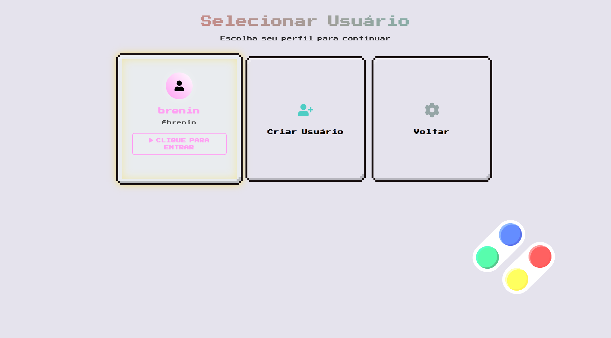
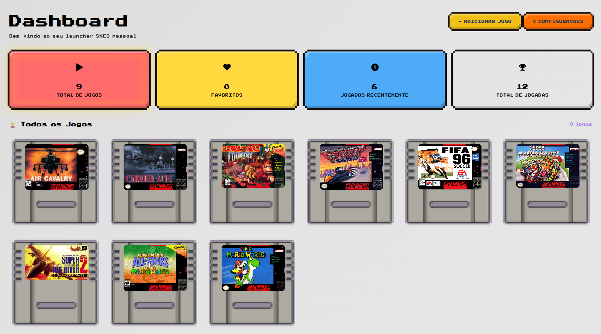
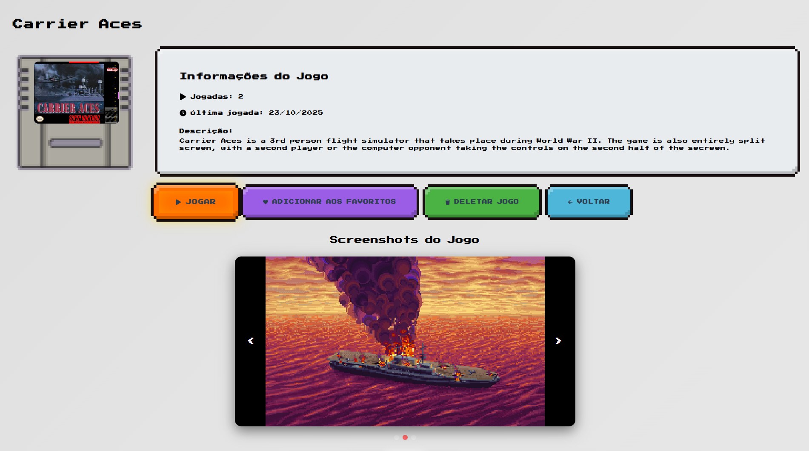
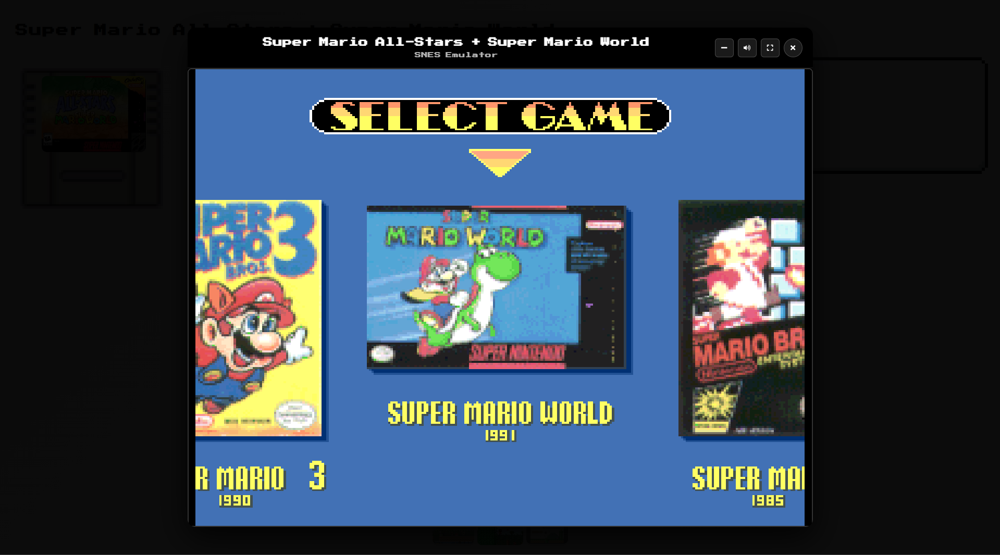

# SNES HUB

A complete SNES launcher developed with React, Electron, and Node.js, offering a modern interface to manage and play Super Nintendo ROMs.

*A modern launcher to relive the nostalgia of SNES games!*

## Screenshots

<div align="center">
  <div style="display: grid; grid-template-columns: repeat(2, 1fr); gap: 20px; max-width: 1000px; margin: 0 auto;">
    
    
    
    
  </div>
</div>

### **Main Features**
- **Intuitive Dashboard**: Modern interface with statistics and quick access to games
- **Game Library**: Complete ROM collection management
- **ROM Upload**: Drag-and-drop system to easily add games
- **Complete Metadata**: Name, description, images, and game information
- **Favorites System**: Mark your favorite games
- **Filters and Search**: Quickly find games
- **Integrated Emulator**: Play directly in the application using EmulatorJS
- **Advanced Settings**: Customize your experience

### **Modern Interface**
- Responsive design with gradients and glassmorphism
- Smooth animations with Framer Motion
- Elegant dark theme
- Reusable and modular components
- Collapsible sidebar
- Interactive game cards

### **Technologies Used**
- **Frontend**: React 18, Styled Components, Framer Motion, Electron
- **Backend**: Node.js, Express, SQLite
- **Upload**: Multer, React Dropzone
- **Icons**: React Icons
- **Notifications**: React Hot Toast
- **Emulation**: EmulatorJS

## Installation and Usage

### Prerequisites
- Node.js 16+ 
- npm or yarn

### Quick Installation
```bash
# Clone the repository
git clone <your-repository>
cd snes-launcher

# Install all dependencies
npm run install-all

# Start development
npm run dev
```

### Manual Installation

#### Backend
```bash
cd backend
npm install
npm run dev
```

#### Frontend
```bash
cd frontend
npm install
npm run electron-dev
```

## Project Structure

```
snes-launcher/
├── backend/                 # Node.js API + SQLite
│   ├── server.js           # Express server
│   ├── database.js         # SQLite configuration
│   ├── package.json        # Backend dependencies
│   └── uploads/            # ROMs and images
│       ├── roms/           # SNES ROMs
│       └── images/         # Game images
├── frontend/               # React + Electron
│   ├── public/            # Public files
│   │   ├── electron.js    # Electron main process
│   │   └── preload.js     # Preload script
│   ├── src/               # React code
│   │   ├── components/    # Reusable components
│   │   ├── pages/         # Application pages
│   │   ├── services/      # API calls
│   │   └── App.js         # Main component
│   └── package.json       # Frontend dependencies
├── package.json           # Main scripts
└── README.md             # This file
```

## How to Use

### 1. **Dashboard**
- View your game statistics
- Access recent and favorite games
- Quickly add new games

### 2. **Add Games**
- Click "Add Game"
- Drag ROMs (.smc, .sfc, .fig) or click to select
- Add optional images
- Fill in name and description
- Save the game

### 3. **Library**
- View all your games
- Use filters (All, Favorites, Recent, Most Played)
- Sort by title, date, etc.
- Search by name or description
- Toggle between grid or list view

### 4. **Play**
- Click any game to open the emulator
- Use on-screen controls or keyboard
- Configure volume and screen ratio
- Save and load states

### 5. **Settings**
- Adjust emulator settings
- Customize the interface
- Manage file folders
- Export/import settings

## Emulator Controls

### Keyboard
- **Arrow Keys**: Move character
- **Z**: Jump
- **X**: Run/Secondary action
- **Enter**: Pause/Unpause
- **Esc**: Settings menu
- **Space**: Play/Pause

### Interface
- **Click**: Interact with elements
- **Drag & Drop**: Add ROMs and images
- **Scroll**: Navigate the library
- **Hover**: View additional information

## Advanced Settings

### Emulator
- **Core**: Snes9x or bsnes
- **Volume**: 0-100%
- **Aspect Ratio**: 4:3, 16:9, or Stretch
- **Auto Save**: Enable/Disable

### Interface
- **Language**: Portuguese, English, Spanish
- **Theme**: Dark (default)
- **Animations**: Enable/Disable
- **FPS**: Show/Hide

### System
- **ROMs Folder**: Customize location
- **Screenshots**: Screenshot folder
- **Updates**: Automatic
- **Minimize**: To system tray

## Development

### Available Scripts
```bash
# Full development
npm run dev

# Backend only
npm run backend

# Frontend only
cd frontend && npm run electron-dev

# Production build
npm run build

# Install all dependencies
npm run install-all
```

### API Endpoints

#### Games
- `GET /api/games` - List all games
- `GET /api/games/:id` - Get game by ID
- `POST /api/games` - Create new game
- `PUT /api/games/:id` - Update game
- `DELETE /api/games/:id` - Delete game
- `POST /api/games/:id/play` - Increment play counter
- `POST /api/games/:id/favorite` - Toggle favorite

#### Files
- `GET /api/roms/:filename` - Serve ROM for emulator
- `GET /uploads/images/:filename` - Serve images

## Future Features

- [ ] Achievement system
- [ ] Multiplayer mode
- [ ] Cloud save
- [ ] Customizable themes

## Contributing

1. Fork the project
2. Create a feature branch
3. Commit your changes
4. Push to the branch
5. Open a Pull Request

## License

This project is licensed under the MIT License. See the `LICENSE` file for more details.

## Acknowledgments

- [EmulatorJS](https://emulatorjs.org/) - Web emulator
- [React](https://reactjs.org/) - UI library
- [Electron](https://electronjs.org/) - Desktop framework
- [Styled Components](https://styled-components.com/) - CSS-in-JS
- [Framer Motion](https://framer.com/motion/) - Animations

---

**Developed with ❤️ by Breno Ribeiro**

